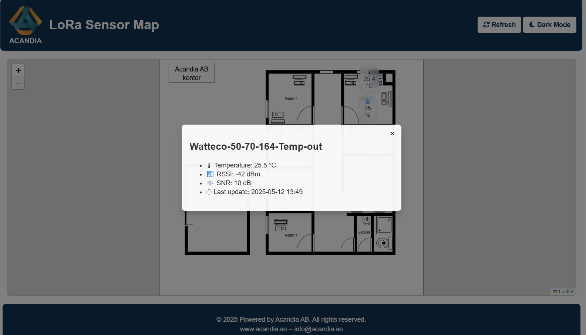
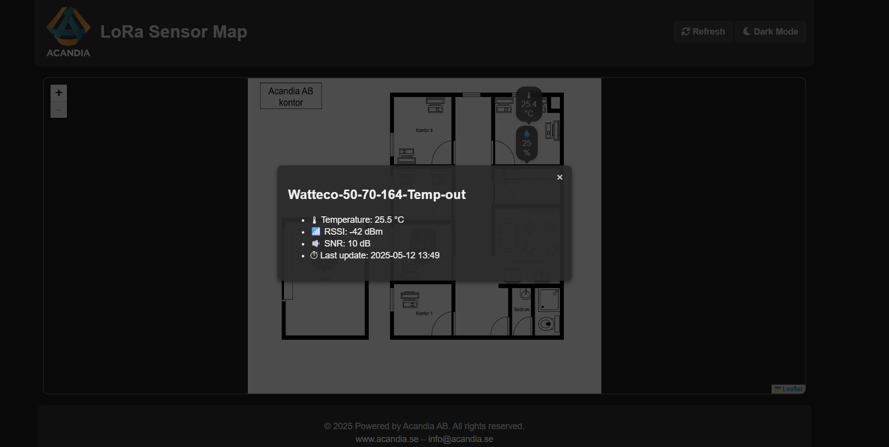
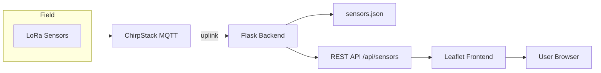

# **LoRa Sensor Map Dashboard**

> **Public Read‑Only Overview**
> A concise, user‑centric snapshot of Acandia’s LoRa Sensor Map Dashboard.

---

## **Introduction**

The **LoRa Sensor Map Dashboard** is a lightweight, browser‑based application that transforms raw LoRaWAN telemetry into an intuitive, map‑centric view. Each incoming sensor appears as a draggable bubble on a floor‑plan, enabling operators to **place devices at their real‑world positions** and monitor live readings at a glance. The purpose is to make complex data friendly for non‑technical staff while still offering engineers full telemetry and API access.

---

## 🎯 **At a Glance**

| Metric           | Value (demo) | Notes                                          |
| ---------------- | ------------ | ---------------------------------------------- |
| Active sensors   | 42           | Auto‑discovered via ChirpStack uplinks         |
| Map refresh rate | ≤ 3 s        | MQTT push → browser update latency             |
| Supported themes | 2            | Light & Dark (auto‑remembered)                 |
| Browser support  | 96 %         | Evergreen browsers (Chromium 90+, Firefox 88+) |

---

## 🎨 **Interface Screenshots**

| Normal Mode                                | Dark Mode                                           |
| ------------------------------------------ | --------------------------------------------------- |
|  |  |

### Sensor Card (Modal)

| Light                                       | Dark                                                       |
| ------------------------------------------- | ---------------------------------------------------------- |
|  |  |

---

## 🔍 **Feature Highlights**

* **Real‑Time MQTT Subscriber** – Listens to ChirpStack uplinks and updates telemetry within seconds.
* **Interactive Floor‑Plan** – Scalable PNG/SVG rendered by Leaflet.js; bubbles auto‑position on incoming data.
* **Drag‑and‑Drop Persistence** – Marker coordinates stored in `sensors.json`; survive page reloads & browser restarts.
* **Modal Sensor Cards** – Click a bubble to reveal temperature, humidity, RSSI, SNR & timestamp.
* **Theme Toggle** – Light/Dark; saved in `localStorage`.
* **Zero‑Config Deployment** – Point to MQTT broker + copy static assets; no database required.

---

## 🏗️ **Architecture Overview**




1. **Sensors** → **ChirpStack** publishes MQTT uplinks.
2. **Flask** subscribes, parses JSON, writes `sensors.json` + broadcasts via Server‑Sent Events (SSE).
3. **Frontend** fetches `/api/sensors` (startup) and listens to `/stream` (SSE) for push updates.
4. User interactions (drag/click) → `PUT /api/coords` → updates `sensors.json`.

---

## ⚙️ **Tech Stack & Dependencies**

| Layer      | Technology                         | Purpose                       |
| ---------- | ---------------------------------- | ----------------------------- |
| Backend    | Python 3.11 · Flask 3 · Paho‑MQTT  | REST API, SSE, MQTT client    |
| Data store | `sensors.json` (flat‑file)         | Lightweight state persistence |
| Frontend   | Leaflet 1.9 · Vanilla JS (+ES6)    | Interactive map & UI          |
| Styling    | CSS Variables + Tailwind Snapshots | Theme switching               |
| Deployment | systemd service                    | Auto‑start on Robustel router |

> **Footprint:** ≤ 30 MB RAM, ≤ 1 % CPU on Robustel EG5120 (ARM Cortex‑A7).

---

## 📑 **Data Model (`sensors.json`)**

```jsonc
[
  {
    "dev_eui": "A84041FFFF1E8F29",   // Unique LoRaWAN ID
    "slave_id": 21,                   // (optional) Modbus mapping
    "name": "Warehouse North‑01",    // Friendly label
    "coords": { "x": 423, "y": 118 }, // Pixel position on floor‑plan
    "telemetry": {
      "temp": 22.4,                   // °C
      "rh": 48.2,                     // %
      "rssi": -87,                    // dBm
      "snr": 9.8,                     // dB
      "ts": 1715683200               // Unix epoch (s)
    }
  },
  ...
]
```

---

## 📡 **API Endpoints (public)**

| Method | Path           | Description                           |
| ------ | -------------- | ------------------------------------- |
| GET    | `/api/sensors` | Return full JSON array of sensors     |
| PUT    | `/api/coords`  | `{dev_eui, x, y}` → update marker pos |
| GET    | `/stream`      | Server‑Sent Event stream (updates)    |

All endpoints are **read‑only** in the public build except `/api/coords`, which validates origin via CSRF token.

---

## 🛡️ **Security & Privacy**

* Uses **unauthenticated read‑only MQTT** topic for demo; production build supports TLS & JWT.
* CORS locked to specific hostname.
* No personal data stored; sensor IDs anonymised in public view.

---

## 🚀 **Quick Start (Demo Build)**

```bash
pip install -r requirements.txt
export MQTT_BROKER=localhost
python app.py  # localhost:5000
```

> Replace `MQTT_BROKER` with your ChirpStack host or SSH‑tunnel.

---

## 🗺️ **User Workflow**

1. **Load** the dashboard URL in a modern browser.
2. **Observe** bubbles animating as live data arrives.
3. **Drag & drop** a bubble → position saved instantly.
4. **Click** any bubble → modal with full telemetry.
5. **Toggle** theme (Light/Dark) → preference remembered.

---

## 🏛️ **Licensing & Usage**

© 2025 Acandia AB. All rights reserved.
This repository contains a limited public snapshot; internal code and deployment scripts reside in Acandia’s private GitLab. Commercial use without written consent is prohibited.
