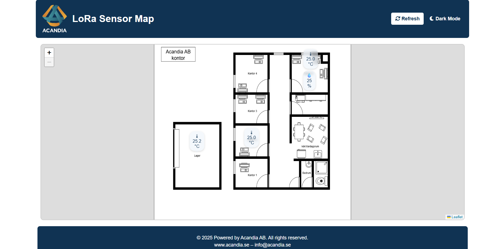
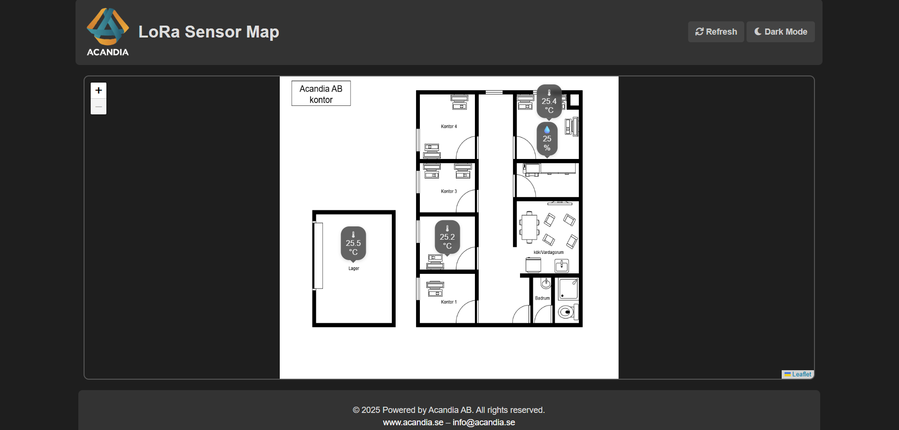
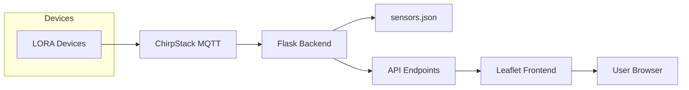
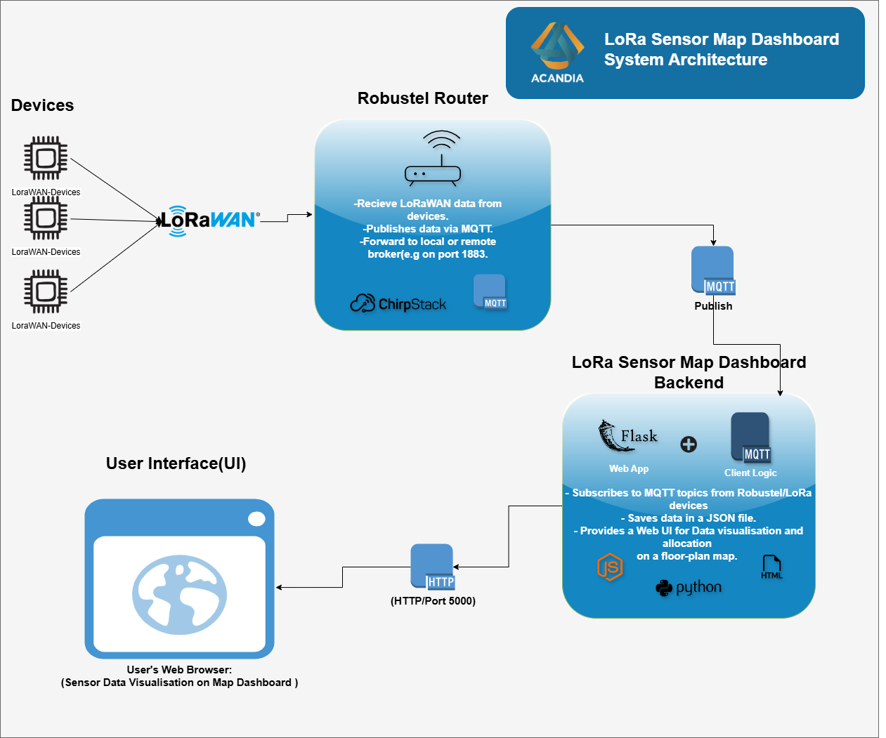

# LoRa Sensor Map Dashboard

> **Public Read‑Only Overview**
> A concise, user‑centric snapshot of Acandia’s LoRa Sensor Map Dashboard.

---

## 🎨 Interface Screenshots

Normal Mode:



Dark Mode:



## 🔍 Features

* **Real‑Time MQTT Subscriber**
  Listens to ChirpStack uplinks and updates telemetry within seconds.
* **Interactive Floor‑Plan**
  Overlays a scalable PNG map via Leaflet.js; bubbles auto‑position on incoming data.
* **Persistent Bubble Placement**
  Drag‑and‑drop markers, saved in JSON, survive page reloads.
* **Modal Sensor Cards**
  Click any bubble to open a styled modal with full telemetry: temperature, humidity, RSSI, SNR, timestamp.
* **Light & Dark Themes**
  Toggle appearance; preference stored in `localStorage` for a seamless experience.

---

## 🏗️ Architecture



### Overview Diagram



1. **Devices** send uplinks → **ChirpStack** → published over MQTT
2. **Flask** subscribes, parses JSON, writes `sensors.json`
3. **Frontend** polls `/api/sensors`, renders within Leaflet map
4. User interactions (drag/click) ↔ API → updates mapping JSON

---

## 👥 User Experience

1. **Load** dashboard URL in modern browser
2. **Observe** bubbles representing live sensor data
3. **Drag** any bubble to new location → saved automatically
4. **Click** a bubble → styled modal reveals detailed metrics
5. **Toggle** theme via top‑bar button; site remembers your choice

---

## 📝 Repository Structure (public‑facing)

```
/static        # public CSS, JS, images
/templates     # map.html, sensor_info.html
/app.py        # minimal Flask server exposing APIs
```

*Complete internal setup, dependencies & installation saved in private repo.*

---

© 2025 Acandia AB. All rights reserved.
